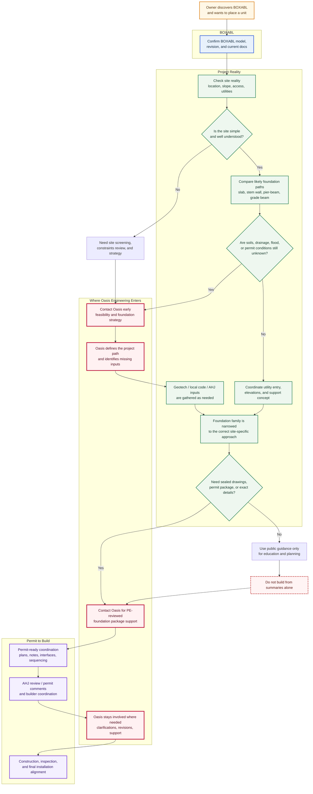

# Service Flow

This visual is meant to answer one practical question:

**Where does Oasis Engineering fit between BOXABL, the homeowner, the builder, the AHJ, and the final foundation package?**

## Read The Diagram Like This

### BOXABL defines the product

BOXABL helps establish the unit, the current model, and the manufacturer document basis.

### The site defines the foundation

As soon as the conversation shifts to soils, slope, drainage, utility entry, permit expectations, or interface details, the project becomes site-specific.

### Oasis enters before expensive mistakes

The best time to bring in Oasis is usually when:

- the site is not obviously simple
- the owner is comparing foundation families
- the utility and elevation strategy is still fuzzy
- the AHJ or permit path is unclear
- a PE-reviewed package will clearly be required

### Public guidance has a hard limit

This repository can educate, orient, and qualify.

It should not be mistaken for a permit-ready foundation package.

## Simple Rule For Homeowners

If you are still asking:

- "What kind of foundation should I use?"
- "Will my site work?"
- "Will the city accept this?"
- "Do I need a geotech or PE?"
- "How do I coordinate utilities and elevation with the unit?"

that is usually the point where Oasis Engineering becomes part of the service.
